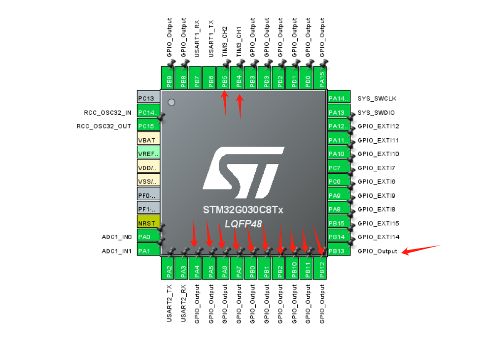

# stm32-lcd2002

## Configuration

You should set the necessary  11 Pins to `GPIO_Output` and 2 Pins to  `TIM3_CHx` at first .

## PWM Control

- [Contrast adjustment](https://www.bilibili.com/video/BV1uNQAYZE9x/?share_source=copy_web&vd_source=a1d4b947ad854292b15642b7c0fb1a3c)
- [Brightness adjustment](https://www.bilibili.com/video/BV1uNQAYZEhk/?spm_id_from=333.1387.homepage.video_card.click&vd_source=d939b06c630702aeb499bac767324c8c)
